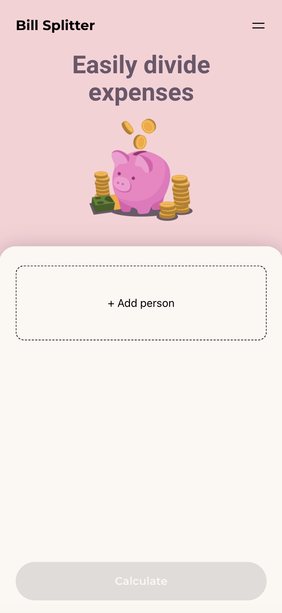
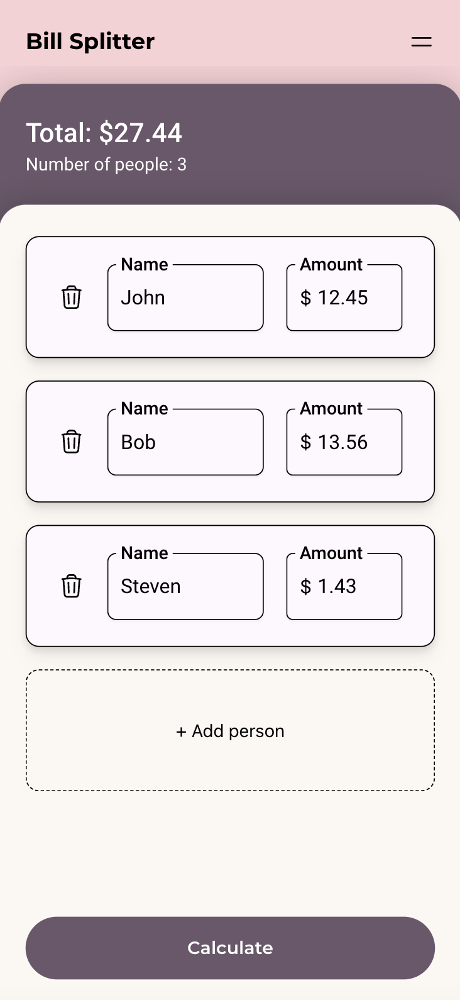
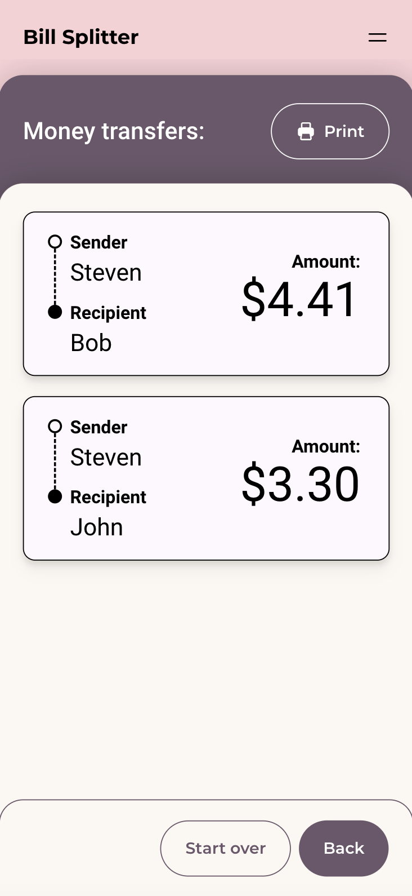

<table style="margin: 0 auto 16px">
  <tr>
    <td>
      
    </td>
    <td>
      
    </td>
    <td>
      
    </td>
  </tr>
</table>

# Bill Splitter

<table>
<tr>
<td>
  Bill Splitter is an app designed to facilitate bill-splitting after transactions have been made. By entering the names and amounts spent by each person, the app calculates the minimum number of transfers needed for those who paid below the average to reimburse those who paid above it. Additionally, it provides the option to generate a transfer list for easy sharing.
</td>
</tr>
</table>

## Link to the app

Here is a link to: [Bill Splitter](bill-splitter-psi.vercel.app)

## Built with

- [![React][React.js]][React-url]
- 

[React.js]: https://img.shields.io/badge/React-20232A?style=for-the-badge&logo=react&logoColor=61DAFB
[React-url]: https://reactjs.org/
[jest]: https://img.shields.io/badge/-jest-%23C21325?style=for-the-badge&logo=jest&logoColor=white
[jest-url]: https://testing-library.com
